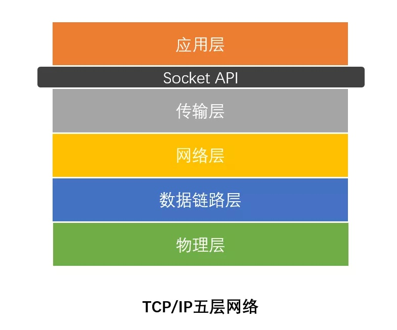

### socket编程底层原理

其中传输层就是TCP所在的地方，socket在这里就是起到连接应用层与传输层的作用
socket的诞生就是为了应用程序能够更方便的将数据经由传输层来传输，所以它本质上是对TCP/IP的运用进行了一层封装，然后应用程序直接调用socket API即可进行通信，分为两部分。

该图展示的就是建立TCP/IP连接的过程，经典叫法为“三次握手”

传输的过程涉及数据Copy。其中的发送缓冲区和接收缓冲区就是套接字缓冲

连接用完后需要关闭。这就是经典的“四次握手”

### 名词注解-以字母表顺序

#### A

#### B
bind():函数 :告诉内核将服务器套接字地址和套接字描述符联系起来 
#### C
connect(int sockfd, struct sockaddr *serv_addr, int addrlen):试图与套接字地址为serv_addr的服务器建立因特网连接
#### D
#### E
errno:全局变量 存放错误消息
#### F
#### G
#### H
#### I
INADDR_ANY : 0X00000000 本机
#### J
#### K
#### L
#### M
memset():函数
#### N
Network Byte order & Host Byte order : 网络字节顺序(从高到低顺序存储)和主机字节顺序(与CPU设计有关)
#### O
#### P
perror():打印错误信息
POSIX 标准 :保证在源码一级在多种操作系统上移植运行
process :进程  fork() vfork()
#### Q
#### R
#### S
socket():API
socket : 套接字 由IP和端口(标识应用进程)组成 包括流套接字和数据报套接字
socket返回的clientfd描述符仅是部分打开，还不能用于读写
system calls : 系统调用 ->进程控制、进程通信、文件系统控制、系统控制、内存管理、网络管理、socket控制、用户管理
#### T
#### U
#### V
#### W
#### X
#### Y
#### Z

